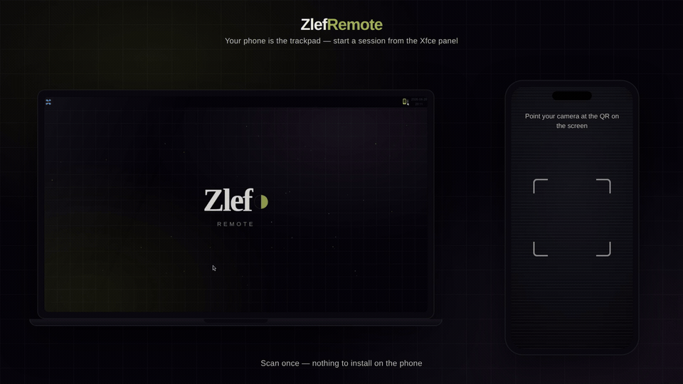

# ZlefRemote

**Your phone is the trackpad.** Control your computer's mouse and keyboard from
any phone — over your local Wi-Fi, or end-to-end encrypted from anywhere through
[remote.zlef.fr](https://remote.zlef.fr). No app store, no account.

```
phone browser ──(AES-256-GCM)──▶ relay (sees only ciphertext) ──▶ agent ──▶ your OS
                       or, on LAN: phone browser ──────────────▶ agent ──▶ your OS
```

Two pieces:

- **The agent** — a single portable binary you run on the computer you want to
  control (Linux / Windows / macOS). It injects mouse & keyboard events.
- **The remote** — a web page that runs in any phone browser. Nothing to install
  on the phone; you open it by scanning the agent's QR code.

## How it works

1. Run the agent. Pick **Local network** or **Remote**.
2. It prints a QR code (and a URL). Scan it with your phone.
3. The phone becomes a trackpad + keyboard + media remote.

## Security model

- The agent generates a random **256-bit key** on every run.
- That key is placed **only in the QR code's URL fragment** (`#k=…`) — the part
  browsers never transmit to a server. The phone reads it locally.
- Every command is sealed with **AES-256-GCM** before it touches the wire.
- In **Remote** mode the relay (`remote.zlef.fr`) only ever sees a room code and
  opaque ciphertext. It holds no key and cannot read a single keystroke.
- In **LAN** mode traffic never leaves your network; the key still gates access
  (a client without it cannot produce a frame that decrypts → cannot inject).

The browser crypto (WebCrypto `AES-GCM`) and the Go crypto (`crypto/cipher` GCM)
are wire-compatible: `base64url(iv) + "." + base64url(ciphertext)`.

## Run the agent

```bash
./zlefremote-agent                 # interactive: choose LAN or Remote
./zlefremote-agent --mode lan      # local network, default port 9783
./zlefremote-agent --mode remote   # pair through remote.zlef.fr (E2EE)
./zlefremote-agent --mode lan --port 8080
./zlefremote-agent --mode remote --relay remote.zlef.fr
./zlefremote-agent --mode remote --remember   # remember this computer (see below)
./zlefremote-agent --remember --reset-identity # rotate the remembered key/room
./zlefremote-agent --no-telemetry  # disable the anonymous usage ping (see below)
./zlefremote-agent -update         # update the binary in place to the latest release
./zlefremote-agent -update -force  # reinstall even if already current
```

### Saved devices & the installable phone app (PWA)

The phone client at `remote.zlef.fr/r/` is an installable PWA ("Add to home
screen"). Its home screen lists your **saved computers** — tap one to reconnect
in a single tap, or "Add a device" to scan/paste a new pairing link.

Reconnect-in-one-tap needs a **stable address**, which is opt-in via
`--remember`:

* By default the agent mints a **fresh key every launch** and the relay hands it
  a **random room** — nothing is stored, and a session is unreachable once it
  ends (the privacy-maximal default).
* With `--remember` the agent persists its 256-bit key locally
  (`<user-config>/zlefremote/identity`, mode `0600`) and asks the relay for a
  room **derived from that key** by a one-way hash. The pairing URL then carries
  `&p=1`, so the phone offers to save the device and can recompute the same room
  on every future launch — no rescan. Rotate with `--reset-identity`.

The derivation is one-way, so the room reveals nothing about the key and is
never sent to any server; only a device that already holds the key (i.e. yours)
can compute it.

### Lock-screen media controls (opt-in)

A web app can't draw *over* the Android lock screen (that needs a native
`showWhenLocked` activity), but it can put a **media card** there. Enable
**Settings → Lock-screen controls** and, while a session is connected, your
phone's lock screen and notification shade show a "ZlefRemote" card whose
play / prev / next (and seek = volume) buttons drive the connected computer's
media keys — pause or skip the computer's music from the lock screen without
unlocking. It's implemented with the Media Session API over an inaudible audio
holder; off by default because holding an audio session pauses media playing on
the phone itself.

The agent checks `https://remote.zlef.fr/api/agent/version` for a newer build on
startup (a one-line stderr hint; disable with `-no-update-check`). `-update`
downloads the build for your OS/arch, verifies its SHA-256, and atomically
replaces the running binary. Installed via apt? Use `apt upgrade` instead.

## Xfce panel plugin

On an Xfce desktop you can start a session and show the pairing QR straight from
the panel — no terminal. See [`panel-plugin/`](panel-plugin/):



Debian/Ubuntu/Mint/Xubuntu — apt (auto-updates via `apt upgrade`):

```bash
curl -fsSL https://apt.zlef.fr/zlef.gpg | sudo tee /usr/share/keyrings/zlef.gpg >/dev/null
echo "deb [signed-by=/usr/share/keyrings/zlef.gpg] https://apt.zlef.fr stable main" \
  | sudo tee /etc/apt/sources.list.d/zlef.list
sudo apt update && sudo apt install zlefremote-xfce-plugin && xfce4-panel -r
```

Other distros (Arch `PKGBUILD` in `packaging/arch/`, or the source tarball):

```bash
cd panel-plugin
./install.sh            # system-wide (sudo) — recommended
./install.sh --user     # per-user, no root
./install.sh --update   # later: fetch latest & reinstall
xfce4-panel -r          # then: panel → Add New Items… → "ZlefRemote"
```

A prebuilt tarball (sources + bundled Linux agent + installer) is linked from the
Download section on <https://remote.zlef.fr>. The plugin drives the same agent
binary in machine mode (`zlefremote-agent -machine`), so all crypto and input
injection happen exactly as in terminal use.

## Telemetry

On startup the agent sends **one** anonymous ping to `remote.zlef.fr/api/agent/ping`
so we can see roughly how many people run it and on what platforms. The ping is
fire-and-forget (never blocks startup) and contains only:

```json
{ "event": "start", "version": "1.0.0", "os": "linux", "arch": "amd64", "mode": "remote" }
```

No personal data, no identifier, no information about your session, your input,
the machine you control, or who you are. It is **never** sent in LAN use beyond
this single startup line, and the session itself is always end-to-end encrypted
regardless.

**Turn it off** — any one of these is enough:

| How | What |
|-----|------|
| Runtime flag | `./zlefremote-agent --no-telemetry` |
| Environment | `DO_NOT_TRACK=1` (or `ZLEFREMOTE_NO_TELEMETRY=1`) |
| Build setting | `TELEMETRY=off ./agent/build.sh` — compiles the default to off (`-ldflags "-X main.telemetryDefault=off"`) |

A build made with `TELEMETRY=off` never pings, with or without the flag.

## Build from source

Real OS input control uses [`robotgo`](https://github.com/go-vgo/robotgo), which
is CGO and builds best **natively per-OS**:

| OS | Prerequisites |
|----|---------------|
| Linux | `gcc libc6-dev libx11-dev libxtst-dev libxkbcommon-dev xorg-dev libxext-dev` |
| macOS | `xcode-select --install` |
| Windows | a gcc (mingw-w64 / msys2) |

```bash
cd agent
./build.sh          # real agent for the current OS  → ../dist/
./build.sh stub     # portable, CGO-free stub (logs input; for testing transport)
```

Prebuilt binaries for all three platforms are produced by GitHub Actions
(`.github/workflows/build.yml`).

## The relay (this repo's web service)

Node + `ws`, stateless blind relay. Modular:

- `server.js` — HTTP (landing + phone client + downloads) and the `/ws` relay.
- `lib/rooms.js` — in-memory rooms; forwards opaque frames host ↔ clients.
- `lib/pages.js`, `lib/i18n.js` — SSR landing (EN/FR).
- `public/app/` — the phone client (also embedded into the agent for LAN mode).

```bash
npm install && npm start    # PORT=10067
```

A zlef.fr project · EN/FR.
