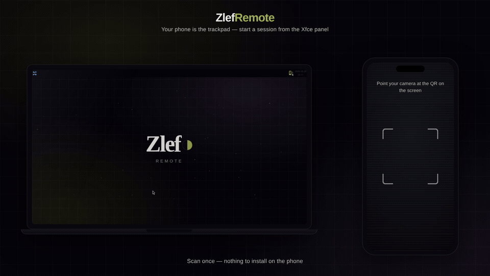

# ZlefRemote


**Your phone is the trackpad.** Control your computer's mouse and keyboard from
any phone — over your local Wi-Fi, or end-to-end encrypted from anywhere through
[remote.zlef.fr](https://remote.zlef.fr). No account.

```
phone app ──(AES-256-GCM)──▶ relay (sees only ciphertext) ──▶ agent ──▶ your OS
                or, on LAN: phone app ──────────────────────▶ agent ──▶ your OS
```

Four pieces:

- **The agent** — a single portable binary you run on the computer you want to
  control (Linux / Windows / macOS). It injects mouse & keyboard events.
- **The Android app** — `app/`, bundle `fr.zlef.remote`, downloaded from
  [remote.zlef.fr](https://remote.zlef.fr/app/zlefremote.apk). Scan the agent's
  QR and the phone is a trackpad, keyboard, media remote and touchscreen. See
  [`app/README.md`](app/README.md). **There is no iOS build** — compiling and
  signing one needs macOS and a paid Apple developer account, and this project
  has neither; iPhones use the web remote below.
- **The web remote** — the same UI as a web page, for phones without the app
  (and what the agent embeds for LAN mode). It used to be an installable PWA;
  it is a plain web client now, and `/sw.js` is a tombstone that retires the
  workers already installed on people's phones.
- **The desktop remote** — for driving one computer from another. Open the SAME
  link on a computer and it runs **in the browser** (nothing to install); a
  [native app](desktop/) exists too, for full keyboard capture.

## How it works

1. Run the agent. Pick **Local network** or **Remote**.
2. It prints a QR code (and a URL). Scan it with your phone — or open the same
   link on a computer for the [browser desktop remote](#desktop-remote--in-the-browser).
3. The phone becomes a trackpad + keyboard + media remote — and a **live screen**.

### Display brightness

The Media tab shows a **screen-brightness slider** when the computer exposes a
controllable backlight. Backends, probed at agent startup:

- **Linux** — `brightnessctl` (X11/Wayland laptops), direct
  `/sys/class/backlight` write, or `xrandr` software gamma (desktops), in that
  order of preference.
- **Windows** — WMI (`WmiMonitorBrightness`), i.e. laptops and monitors whose
  driver exposes a backlight.
- **macOS** — the `brightness` CLI (`brew install brightness`).

If none is usable the slider simply doesn't appear. Brightness never goes below
5% so a remote slip can't black the screen out.

### Live screen view

Open the **Screen** tab on the phone to see the computer's screen in real time
and drive it like a touchscreen:

- **Tap** = left click at that point · **double-tap** = double click ·
  **two-finger tap** = right click · **drag your finger** = move the pointer live.
- Three quality presets — **Low / Balanced / Sharp** (trade frame rate and
  sharpness for bandwidth); retune live from the bar under the view.
- **Multi-monitor**: computers with several displays get a monitor picker under
  the view — switch the streamed display (and where taps land) with one tap.
  The agent's pairing handshake lists displays (`screens` in `welcome`); the
  view request carries the chosen index (`d`).
- The agent captures the screen, downscales + JPEG-encodes it, and streams it in
  chunks that stay under the relay's frame ceiling. Every frame is sealed with
  the same **AES-256-GCM** key as input — the relay never sees your screen.
- Screen capture needs the real input backend (built with `-tags robotgo`, which
  already needs a display). The Screen tab only appears when the connected agent
  reports it can capture (`cap.screen` in the pairing handshake).

### Why LAN mode is HTTPS

Browsers only expose `crypto.subtle` — the AES-256-GCM this protocol is built on
— in a **secure context**, and `http://192.168.x.y` is not one. So in LAN mode
the agent serves TLS with a certificate it mints for itself (cached in
`~/.config/zlefremote/lan-cert.pem`, covering this machine's addresses). Your
browser warns once; tap *Advanced → Proceed* and the origin becomes secure.

The certificate is not what protects the session — every frame is sealed with
the key from the link, which never leaves the two devices. TLS only buys the
secure context.

## Security model

- The agent generates a random **256-bit key** on every run.
- That key is placed **only in the QR code's URL fragment** (`#k=…`) — the part
  browsers never transmit to a server. The phone reads it locally.
- Every command is sealed with **AES-256-GCM** before it touches the wire.
- In **Remote** mode the relay (`remote.zlef.fr`) only ever sees a room code and
  opaque ciphertext. It holds no key and cannot read a single keystroke.
- In **LAN** mode traffic never leaves your network; the key still gates access
  (a client without it cannot produce a frame that decrypts → cannot inject).

The browser crypto (WebCrypto `AES-GCM`) and the Go crypto (`crypto/cipher` GCM)
are wire-compatible: `base64url(iv) + "." + base64url(ciphertext)`.

## Run the agent

```bash
./zlefremote-agent                 # interactive: choose LAN or Remote
./zlefremote-agent --mode lan      # local network, default port 9783
./zlefremote-agent --mode remote   # pair through remote.zlef.fr (E2EE)
./zlefremote-agent --mode lan --port 8080
./zlefremote-agent --mode remote --relay remote.zlef.fr
./zlefremote-agent --mode remote --remember   # remember this computer (see below)
./zlefremote-agent --remember --reset-identity # rotate the remembered key/room
./zlefremote-agent --no-telemetry  # disable the anonymous usage ping (see below)
./zlefremote-agent -update         # update the binary in place to the latest release
./zlefremote-agent -update -force  # reinstall even if already current
```

### Saved devices

Both the app and the web remote list your **saved computers** — tap one to
reconnect, or add one by scanning/pasting a new pairing link. The app keeps the
keys in the Android Keystore; the web client keeps them in `localStorage`.

Reconnect-in-one-tap needs a **stable address**, which is opt-in via
`--remember`:

* By default the agent mints a **fresh key every launch** and the relay hands it
  a **random room** — nothing is stored, and a session is unreachable once it
  ends (the privacy-maximal default).
* With `--remember` the agent persists its 256-bit key locally
  (`<user-config>/zlefremote/identity`, mode `0600`) and asks the relay for a
  room **derived from that key** by a one-way hash. The pairing URL then carries
  `&p=1`, so the phone offers to save the device and can recompute the same room
  on every future launch — no rescan. Rotate with `--reset-identity`.

The derivation is one-way, so the room reveals nothing about the key and is
never sent to any server; only a device that already holds the key (i.e. yours)
can compute it.

### Lock-screen media controls (opt-in)

A web app can't draw *over* the Android lock screen (that needs a native
`showWhenLocked` activity), but it can put a **media card** there. Enable
**Settings → Lock-screen controls** and, while a session is connected, your
phone's lock screen and notification shade show a "ZlefRemote" card whose
play / prev / next (and seek = volume) buttons drive the connected computer's
media keys — pause or skip the computer's music from the lock screen without
unlocking. It's implemented with the Media Session API over an inaudible audio
holder; off by default because holding an audio session pauses media playing on
the phone itself.

The agent checks `https://remote.zlef.fr/api/agent/version` for a newer build on
startup (a one-line stderr hint; disable with `-no-update-check`). `-update`
downloads the build for your OS/arch, verifies its SHA-256, and atomically
replaces the running binary. Installed via apt? Use `apt upgrade` instead.

## Xfce panel plugin

On an Xfce desktop you can start a session and show the pairing QR straight from
the panel — no terminal. See [`panel-plugin/`](panel-plugin/):



Debian/Ubuntu/Mint/Xubuntu — apt (auto-updates via `apt upgrade`):

```bash
curl -fsSL https://apt.zlef.fr/zlef.gpg | sudo tee /usr/share/keyrings/zlef.gpg >/dev/null
echo "deb [signed-by=/usr/share/keyrings/zlef.gpg] https://apt.zlef.fr stable main" \
  | sudo tee /etc/apt/sources.list.d/zlef.list
sudo apt update && sudo apt install zlefremote-xfce-plugin && xfce4-panel -r
```

Other distros (Arch `PKGBUILD` in `packaging/arch/`, or the source tarball):

```bash
cd panel-plugin
./install.sh            # system-wide (sudo) — recommended
./install.sh --user     # per-user, no root
./install.sh --update   # later: fetch latest & reinstall
xfce4-panel -r          # then: panel → Add New Items… → "ZlefRemote"
```

A prebuilt tarball (sources + bundled Linux agent + installer) is linked from the
Download section on <https://remote.zlef.fr>. The plugin drives the same agent
binary in machine mode (`zlefremote-agent -machine`), so all crypto and input
injection happen exactly as in terminal use.

## Windows tray app

The same idea on Windows: the app sits in the notification area, and the popup
starts a session and shows the QR. See [`tray/`](tray/).


Grab the installer from the Download section on <https://remote.zlef.fr> (it
bundles the tray app *and* the agent, installs per-user into
`%LOCALAPPDATA%\Programs\ZlefRemote`, no UAC), or the portable `.zip` if you'd
rather not install anything. Right-click the icon for start/stop, "copy the
pairing link", "start with Windows" and an in-place agent update.

Unlike the agent (cgo/robotgo, built natively per OS), the tray is pure Win32
syscalls, so it cross-compiles from anywhere:

```bash
cd tray
./build.sh                                # → ../dist/zlefremote-tray-windows-*.exe
VERSION=1.0.0 ../packaging/windows/build.sh amd64   # installer + portable zip (needs makensis)
```

Like the panel plugin, it drives `zlefremote-agent -machine` and renders the
`@zr` protocol — no second implementation of the transport, the crypto or the
input injection.

## Desktop remote — in the browser

Controlling a computer *from* a computer needs no install: open the same pairing
link there and the browser gets a desktop-shaped remote at **`/d/<room>`** (the
phone UI lives at `/r/<room>`; opening `/r/` on a desktop offers to switch).

- the host's screen fills the window, and **clicking it takes control** —
  the pointer is locked, so it can't wander off mid-drag;
- **typing is layout-safe**: the browser hands us the character your keyboard
  composed (AltGr, dead keys, accents), and the agent injects it in *its* layout;
- **Right Ctrl is the local menu key**: tap = take / give back control,
  `+F` fullscreen, `+P` quality, `+M` next screen, `+K` raw keys, `+C` push
  clipboard, `+Del` Ctrl+Alt+Del, `+Tab` Alt+Tab, `+S` Super, `+Q` disconnect,
  `+/` the list;
- clipboard sharing, key hold/release and the latency readout need agent ≥ 1.7.0.

Browsers reserve a few shortcuts for themselves (Ctrl+W, Ctrl+T, Alt+Tab,
Escape). In Chrome/Edge, going fullscreen turns on the Keyboard Lock API and
even those reach the remote machine; elsewhere the chords above send them
explicitly. The [native client](desktop/) captures everything without that
caveat — same protocol, same rooms.

## Telemetry

On startup the agent sends **one** anonymous ping to `remote.zlef.fr/api/agent/ping`
so we can see roughly how many people run it and on what platforms. The ping is
fire-and-forget (never blocks startup) and contains only:

```json
{ "event": "start", "version": "1.0.0", "os": "linux", "arch": "amd64", "mode": "remote" }
```

No personal data, no identifier, no information about your session, your input,
the machine you control, or who you are. It is **never** sent in LAN use beyond
this single startup line, and the session itself is always end-to-end encrypted
regardless.

**Turn it off** — any one of these is enough:

| How | What |
|-----|------|
| Runtime flag | `./zlefremote-agent --no-telemetry` |
| Environment | `DO_NOT_TRACK=1` (or `ZLEFREMOTE_NO_TELEMETRY=1`) |
| Build setting | `TELEMETRY=off ./agent/build.sh` — compiles the default to off (`-ldflags "-X main.telemetryDefault=off"`) |

A build made with `TELEMETRY=off` never pings, with or without the flag.

## Build from source

Real OS input control uses [`robotgo`](https://github.com/go-vgo/robotgo), which
is CGO and builds best **natively per-OS**:

| OS | Prerequisites |
|----|---------------|
| Linux | `gcc libc6-dev libx11-dev libxtst-dev libxkbcommon-dev xorg-dev libxext-dev` |
| macOS | `xcode-select --install` |
| Windows | a gcc (mingw-w64 / msys2) |

```bash
cd agent
./build.sh          # real agent for the current OS  → ../dist/
./build.sh stub     # portable, CGO-free stub (logs input; for testing transport)
```

The desktop client is a separate module and builds the same way (Ebitengine
needs cgo + GL/X headers on Linux and macOS, none on Windows):

```bash
cd desktop
./build.sh                 # current OS/arch → ../dist/
./build.sh windows amd64   # cross-build from Linux
```

Prebuilt binaries for all three platforms — agent, Windows front-end and
desktop client — are produced by GitHub Actions (`.github/workflows/build.yml`).

## The relay (this repo's web service)

Node + `ws`, stateless blind relay. Modular:

- `server.js` — HTTP (landing + phone client + downloads) and the `/ws` relay.
- `lib/rooms.js` — in-memory rooms; forwards opaque frames host ↔ clients.
- `lib/pages.js`, `lib/i18n.js` — SSR landing (EN/FR).
- `public/app/` — the phone client (also embedded into the agent for LAN mode).

```bash
npm install && npm start    # PORT=10067
```

A zlef.fr project · EN/FR.
