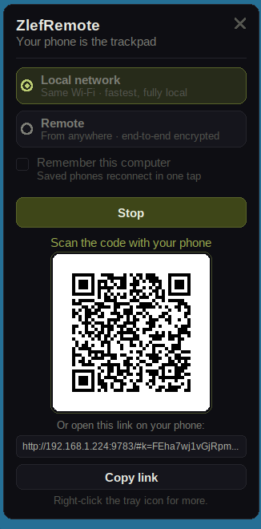

# ZlefRemote — Windows tray app

The Windows counterpart of the [Xfce panel plugin](../panel-plugin): start a
[ZlefRemote](https://remote.zlef.fr) session and show the pairing QR from the
notification area — no terminal, no console window. Click the icon, pick **Local
network** or **Remote**, hit **Start**, scan with your phone.



## Install

**Installer (recommended)** — bundles the tray app *and* the agent, installs
per-user into `%LOCALAPPDATA%\Programs\ZlefRemote` (no UAC prompt), optional
"start with Windows":

<https://remote.zlef.fr> → Download → **Windows**

**Portable** — `zlefremote-windows-portable-amd64.zip`: unzip anywhere, run
`ZlefRemote.exe`. The agent sits next to it; if it's missing, the app offers to
download it (SHA-256 verified against the release manifest).

Not code-signed yet, so SmartScreen may warn on first run ("More info" → "Run
anyway").

## What it does

Everything the panel plugin does, plus the bits Windows users expect:

| | |
|---|---|
| Mode picker | Local network / Remote, remembered across restarts (`HKCU\Software\ZlefRemote`) |
| Remember this computer | passes `-remember` (remote mode only), capability-probed on the resolved agent |
| Pairing block | crisp QR re-rendered per DPI, pairing URL, copy-to-clipboard |
| Connected phones | live roster with IPs, straight off the `@zr peer=` stream |
| Tray icon | status dot — olive while waiting, grape once a phone is on |
| Balloons | phone paired / phone gone, while the popup is closed |
| Right-click menu | start LAN/remote, stop, copy link, start with Windows, update the agent, quit |

It never injects input itself: it runs `zlefremote-agent.exe -machine` and
renders the `@zr key=value` protocol (see `agent/machine.go`), so transport,
end-to-end encryption and input injection stay in the one agent implementation.

## Design notes

- **Pure syscalls, no cgo** — the whole app is `golang.org/x/sys/windows`
  `LazyDLL` calls, so it cross-compiles from the Linux host (`CGO_ENABLED=0`)
  instead of needing a Windows box like the agent does (robotgo/cgo).
- **Owner-drawn popup** — one `WS_POPUP` window painted into a memory DC and
  blitted once. Win32 common controls fight the zlef dark identity at every
  turn; hand-painting also keeps one DPI-aware layout pass (`buildLayout`)
  feeding both the painter and hit-testing, so they can't drift apart.
- **Job object** — the agent is started in a kill-on-close job, so a crashed or
  killed tray never leaves an agent behind holding an open relay room.
- **QR from the URL, not the PNG** — the agent also writes a PNG, but scaling it
  with GDI blurs module edges; rasterising the module matrix at an integer
  module size stays scannable at any DPI (the PNG remains the fallback).
- **Per-user everything** — settings, "start with Windows" and the install all
  live under HKCU/`%LOCALAPPDATA%`. Elevating would write the Run key into the
  *administrator's* hive, the classic way a tray app never starts for the person
  who installed it.

## Build

```bash
cd tray
./build.sh                    # amd64 + arm64 → ../dist/zlefremote-tray-windows-*.exe
go test ./...                 # protocol + i18n tests (run anywhere)
```

`build.sh` packs `assets/icon-*.png` into `assets/zlefremote.ico`, then embeds it
with the manifest (`asInvoker`, per-monitor-v2 DPI) via `rsrc`, and links with
`-H windowsgui` so no console window ever appears.

Installer + portable zip (needs `makensis`, and the agent binary in `../dist`):

```bash
VERSION=1.0.0 ../packaging/windows/build.sh amd64
```

## Developing the UI without a phone

`tools/fakeagent` replays the machine protocol — waiting → paired → (optionally)
disconnected — with no network and no input stack:

```bash
GOOS=windows go build -o /tmp/fakeagent.exe ./tools/fakeagent
ZLEFREMOTE_AGENT=/tmp/fakeagent.exe ZlefRemote.exe -window -lang fr
```

Flags worth knowing: `-window` (open the popup at launch), `-start lan|remote`
(start a session immediately), `-lang en|fr`, `-agent <path>`.

This is also how the app is verified from the Linux host: Wine under Xvfb, with
`wine explorer /desktop=…` providing a systray.
